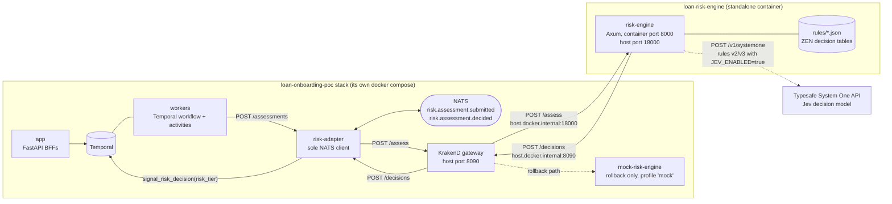
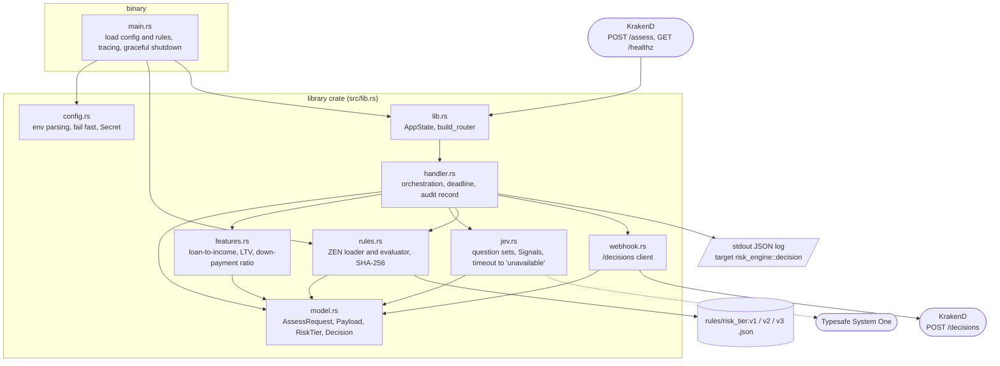
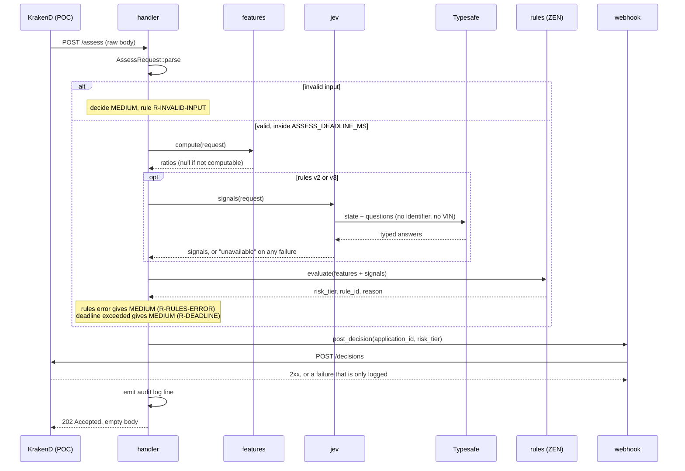

# Component architecture

Two views: where the service sits between loan-onboarding-poc and Typesafe, and how the
modules inside it depend on each other. `CLAUDE.md` holds the contract and invariants
these diagrams illustrate.

## 1. Deployment: two stacks that meet at host ports

The risk engine runs as its own container, started from this repo. It shares no Docker
network with the POC; each side reaches the other through a published host port.

What the POC does with the answer:

| `risk_tier` | POC outcome |
|---|---|
| `LOW` | approved automatically |
| `MEDIUM` | `PENDING_UNDERWRITING` (human review; loans ≥ $50,000 escalate to a Manager) |
| `HIGH` | rejected automatically |

## 2. Inside the service

Arrows point from a module to what it depends on. `features` and `model` do no I/O. Only
`jev` talks to Typesafe and only `webhook` talks to KrakenD.

## 3. One assessment, step by step

## How the invariants map onto the components

| Invariant | Where it is enforced |
|---|---|
| I1: tier is always `LOW`, `MEDIUM` or `HIGH` | `RiskTier` enum in `model.rs`; `rules.rs` rejects any other literal; `handler.rs` falls back to `MEDIUM` |
| I2: Jev can only move `LOW` to `MEDIUM` | rule order in `rules/risk_tier.v2.json` and `v3.json`: every `HIGH` rule is deterministic and sits first, every Jev rule outputs `MEDIUM` |
| I3: no Jev means no auto-approve | `jev.rs` collapses every failure to `unavailable`; rule `M1` turns that into `MEDIUM` |
| I4: Manager path stays reachable | amounts from 50,000 up to the 100,000 cut-off stay `MEDIUM` in every rules version |
| I5: invalid input gives `MEDIUM` | `handler.rs` takes the raw body and decides before the rules run |
